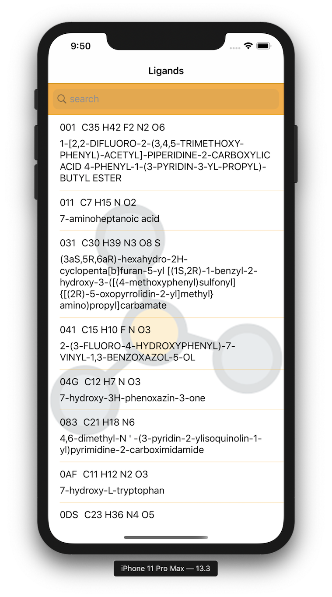

# Portfolios

## Me talking about me

Hi, my name is **Arthur Masson** and I'm passionate about creating random automatized things.
I've always loved mathematics, smart thinking and reliable logic but we all know those three things are kind of the same thing !

I have started to love programming since the first time I created a custom map in warcraft3 and never really stopped learning new things since then.

Aside of that I spend lot of my time playing video games...
So much that if I had not spent this *potentially* productive time playing but instead creating my own game then I would have made ~~a game~~ the best game of all time that would have wasted the social life of an entire generation instead of just mine ! I'm glad I'm not that kind of monster and I contain myself of doing so by playing more games O:)

I've started programming in C when I was in high school and I've always liked it until I discovered that other languages existed as well... Oh my god, such a life changing even the day I found out about C++ !
That thing I was doing with my uniformalized structures and function and those code template I had to copy and paste for each one of my different types was already a thing ! It was called *Object Oriented Programing*... Awesome !... I'm less ignorant now !

Therefore, C++ stayed my favorite language for a long time. The main reason was because I have gotten really familiar with its syntax but also because it was the best langage to create video games ! (wich was and probably will keep being one of my ambitions)

I've then wanted to create graphical programs (because for some reason, playing pacman on command-line was getting boring) so as an eternal Mac user, I had to leave my new favorite langage for another one to use all of those amazing graphical frameworks designed by Apple : The language Objective-C (ever heard about that ?) I never really liked it but had to use it so I did.
And of course, as I was still in high school back then, there was no one understanding what I was doing or being able to tell me that there was other technologies than natives frameworks. I could use some things like SDL or Qt to stay in C++ !
So I did learn all about this Cocoa framework and used it to create random graphical programs and all those great things we make with interfaces (bye bye command line... For now :D). And that's how I got used to work in the Apple ecosystem and have been slowly slipping from desktop development to iOS development. It was only a matter of framework and nothing else !

After high school, I got accepted in a special school called "42 Born to code".
(I call it special because it's a school with a really different way of teaching students traditional schools that I won't explain.)
It's in this school that I finally met my own breed: Others passionated coders.

Then one day Apple created his own new and modern language called **Swift**...
Wow ! My life had a new purpose since ! Two weeks of using Swift made me fall in love with this perfectly designed language !
I'm not an addict of mobile plateform... As a matter of fact, I hate playing on those... But games aren't the only thing we do on our phones (I guess).
So for the only reason that I love the Apple ecosystem, I've spend lot of time creating apps for iPhone and Mac !

I really like working in a group, not only for the social interactions, but also because when I'm alone on a project, I tend to let it drown after a day of not working on it or just with the random idea of another useless project

## My experiences with iOS

My experience with iOS started with Objective-C, when we still had to retain and release our memory (the time when I was free to imagine my own retarded life-cycles instead of using thoses complicated "weak" and "strong" keywords !).

I made a lot of little projects during my learning of the different modules of Cocoa on both macOS and iOS. I won't list all of them but will instead show you the big ones that are actually interesting.

### Swifty companion

The goal of this project was to get familiar with the usage of an API (a relatively important concept when doing front-end I guess). And I tought it was a nice oportunity to use most of the thing we often have to use when developing an App !

The usage of the app is quite simple. We have to type the login of a student in a search bar and the application will call the school API for all informations it can find and then render it all

So here is a list of everything that app is using :
- navigation controller (and segue)
- auto layout (of course)
- many basic views (UITextField, UILabel, UIActivityIndicator, UIButton, UIImageView, UIStackView, UISegmentedControl, UIProgressView, UIVisualEffectView)
- advanced view (UITableView, UICollectionView)
- custom view (a view that is drawn using UIBezierPath)
- CocoaPods (some svg viewer)

 

### Swifty protein

This application is a 3D visualisator of protein molecules downloaded from the website https://www.rcsb.org

It is using SceneKit as main 3D rendering engine

### Arator

## My journey in graphics programming

### Ray tracing

### GLScene

## Future ambitions
